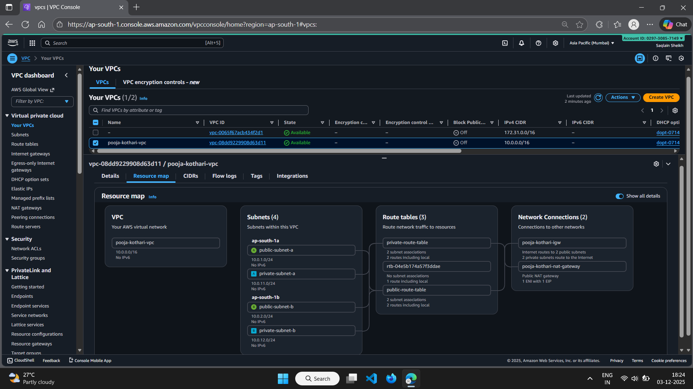
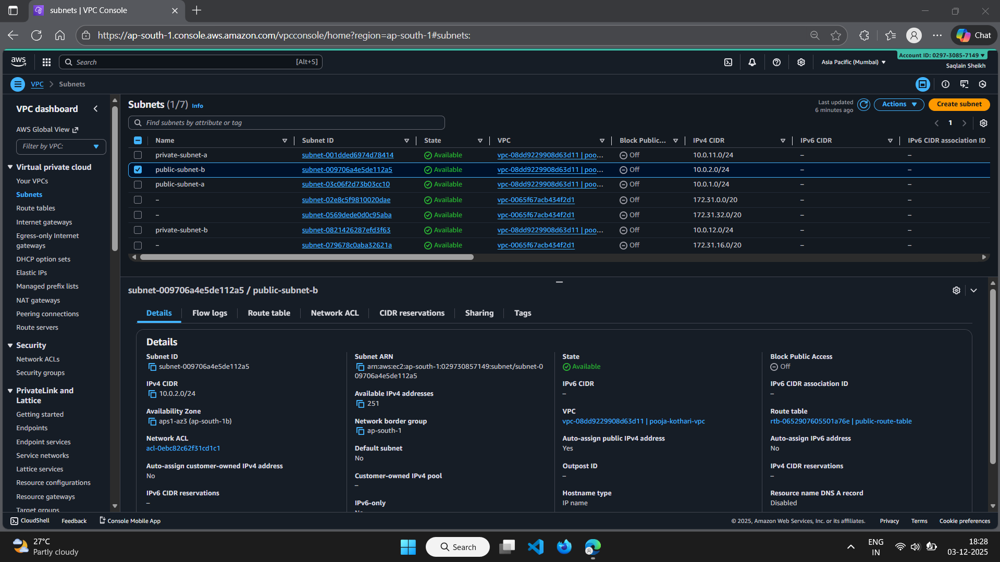
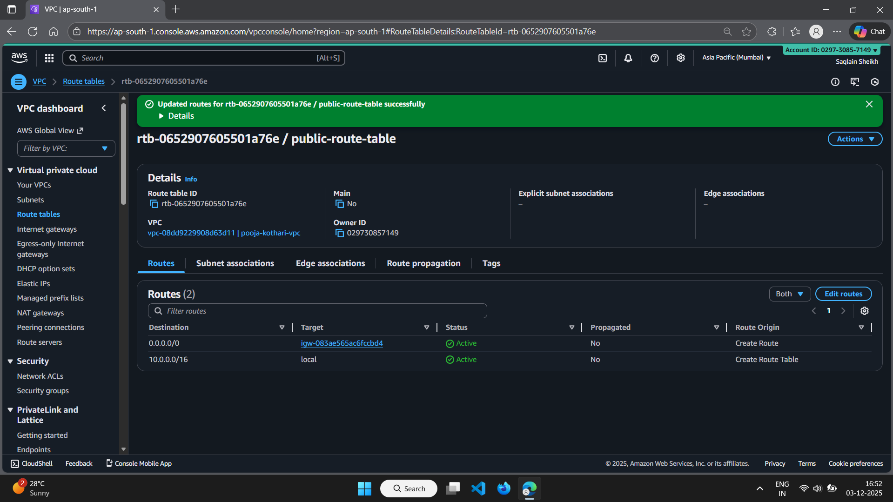
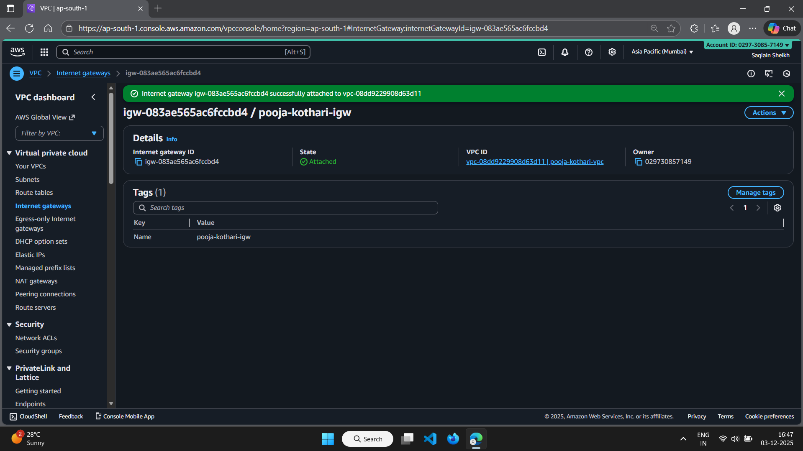
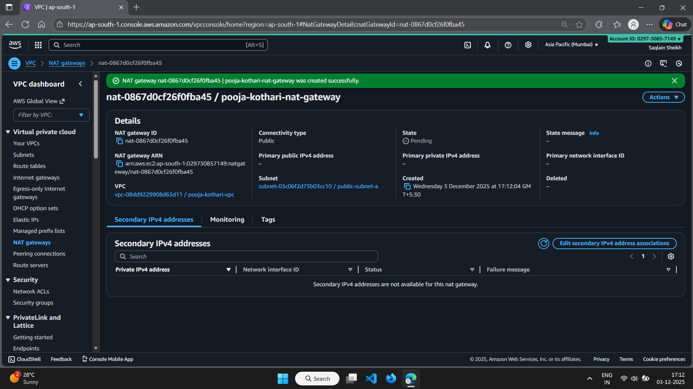

# VPC - Networking & Subnetting (AWS) — Pooja Kothari

## Summary
This folder contains Terraform code (vpc.tf) used to create a VPC and subnets for the Networking & Subnetting task.

**Resources created**
- VPC: `pooja-kothari-vpc` — 10.0.0.0/16  
- Public subnets: `10.0.1.0/24` (ap-south-1a), `10.0.2.0/24` (ap-south-1b)  
- Private subnets: `10.0.11.0/24` (ap-south-1a), `10.0.12.0/24` (ap-south-1b)  
- Internet Gateway: `pooja-igw` attached to VPC  
- Public route table (0.0.0.0/0 → IGW) associated with public subnets  
- NAT Gateway: `pooja-kothari-nat-gateway` (in public-subnet-a) + Elastic IP

## Screenshots
### VPC

### Subnets

### Route Tables

### Internet Gateway (IGW)

### NAT Gateway

## GitHub repo
Link to the repository (root): `https://github.com/poojakothari0508/pooja-kothari-aws-assessment.git`
